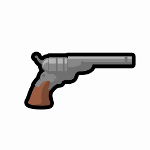

# Supernatural Weapons — Reforged

**Two anomalous weapons for RimWorld — ported to 1.6.**

---

## What this is

The original **Supernatural Weapons** stopped at RimWorld 1.5. This is a port to **1.6**.

It adds two anomalous weapons:

- **The Revolver** — a weapon that kills anything with a single shot.
- **Mark of the Killer** — a curse that creates an immortal supersoldier, at a cost.

## Requirements

| Mod | Why |
|---|---|
| **Anomaly** (DLC) | The mod uses its research tab and its threat level |
| **Vanilla Expanded Framework** | Provides `MVCF.dll`, used by the mod's weapons |
| **EBSG Framework** | Provides the needs and thoughts the curse uses |

## Installation

1. Copy the `Supernatural Weapons (Reforged)` folder into RimWorld's `Mods` folder.
2. Enable the mod **after** its dependencies in the mod list.
3. The weapons appear behind **Anomaly research**; in developer mode you can spawn them directly.

## About the port

The mod ships a **DLL compiled for 1.5** and there is no source code for it. This port keeps that
DLL: it loads and works correctly in 1.6, which was the main risk and is verified. What needed
changing was the definitions:

| Problem | Cause |
|---|---|
| **Textures failed to load.** | The mod splits its content between the root folder and a version folder; the folder map has to list both. |
| **A def field that 1.6 no longer has** (`causesNeed`). | Removed — the mod's own component attaches that need anyway. |
| **An Ideology relic warning.** | The weapon is listed as a possible relic and was missing `CompStyleable`. |

## Credits

**Supernatural Weapons** was created by **Artemiish**. This port keeps the original authorship
untouched, including the mod's own metadata and its name.

- Original Steam Workshop page: <https://steamcommunity.com/sharedfiles/filedetails/?id=3299351531>

## Development notes

The commit history is the documentation: every change has a commit explaining what was broken and
why. The port documentation itself is kept outside this repository, as internal working material.

